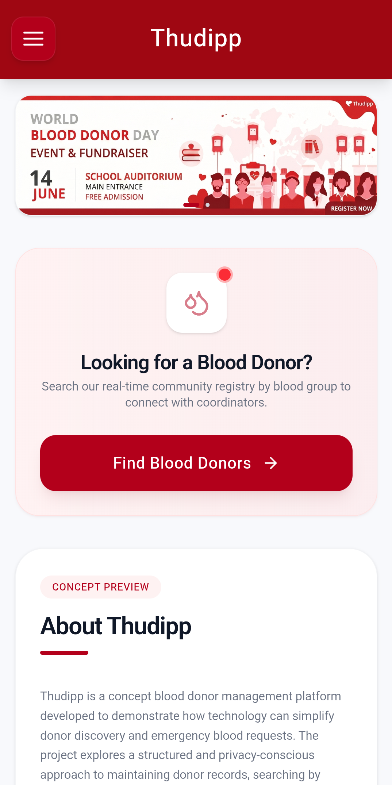
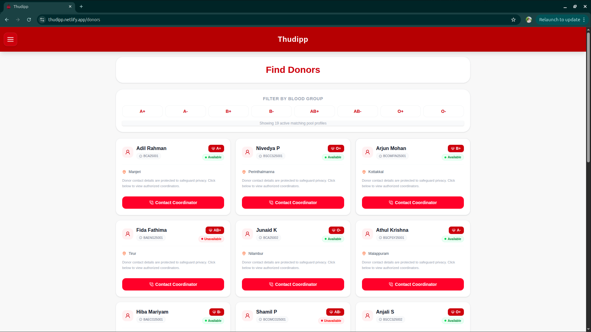
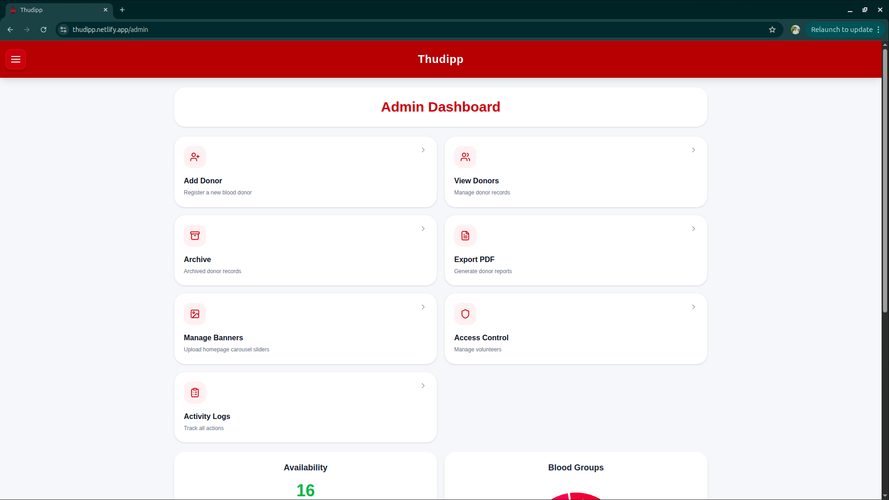

# Thudipp

---

## About Thudipp

During blood emergencies, finding a suitable donor often depends on WhatsApp forwards, phone calls, or shared spreadsheets. While these methods work, they can be slow, unorganized, and sometimes expose personal information that should remain private.

**Thudipp** was created to solve that problem.

It helps colleges and organizations maintain a structured blood donor registry while protecting donor privacy. Instead of exposing donor contact details publicly, the platform allows authorized coordinators to manage communication between patients and donors.

The goal is simple: **make donor discovery faster without compromising privacy.**

---

## Features

### 🔍 Public Search

* Search donors by blood group
* Check donor availability status
* View blood group availability without accessing private information
* Reach out through designated coordinators

### 👥 Volunteer Dashboard

* Permission-based access system
* Add and update donor records
* Access only the features assigned by administrators
* Simple workflow for managing donor information

### 🛡️ Admin Dashboard

* Manage donor records
* Create and manage volunteer accounts
* Configure role-based permissions
* Monitor system activity through logs
* Export donor registry data when required

---

## Privacy First

Protecting donor information is one of the core objectives of Thudipp.

The platform follows a role-based access model where:

* Phone numbers remain hidden by default
* Sensitive personal information is protected
* Volunteers only access information relevant to their responsibilities
* Administrative actions can be tracked through activity logs

This approach reduces unnecessary exposure of donor data while keeping coordination efficient.

---

## Tech Stack

| Technology       | Usage                      |
| ---------------- | -------------------------- |
| React            | Frontend                   |
| React Router DOM | Routing                    |
| Tailwind CSS     | Styling                    |
| Recharts         | Analytics & Visualizations |
| Supabase         | Backend Services           |
| PostgreSQL       | Database                   |

---

## 📷 Screenshots

### Home Page

### Donor Search

### Admin Dashboard

### Analytics Dashboard

---

## Current Status

⚠️ Thudipp is currently a prototype project.

The donor records used in the system are sample records created for testing and development purposes. The platform is not intended to serve as an official medical registry in its current state.

---

## Future Plans

* Database-level encryption for sensitive information
* SMS and Email notification support
* Emergency donor alert system
* Location-aware donor matching
* Improved authentication and session management
* Multi-college deployment support

---

## Demo Access

Interested in testing the Admin or Volunteer dashboard? Contact me for demo access.
